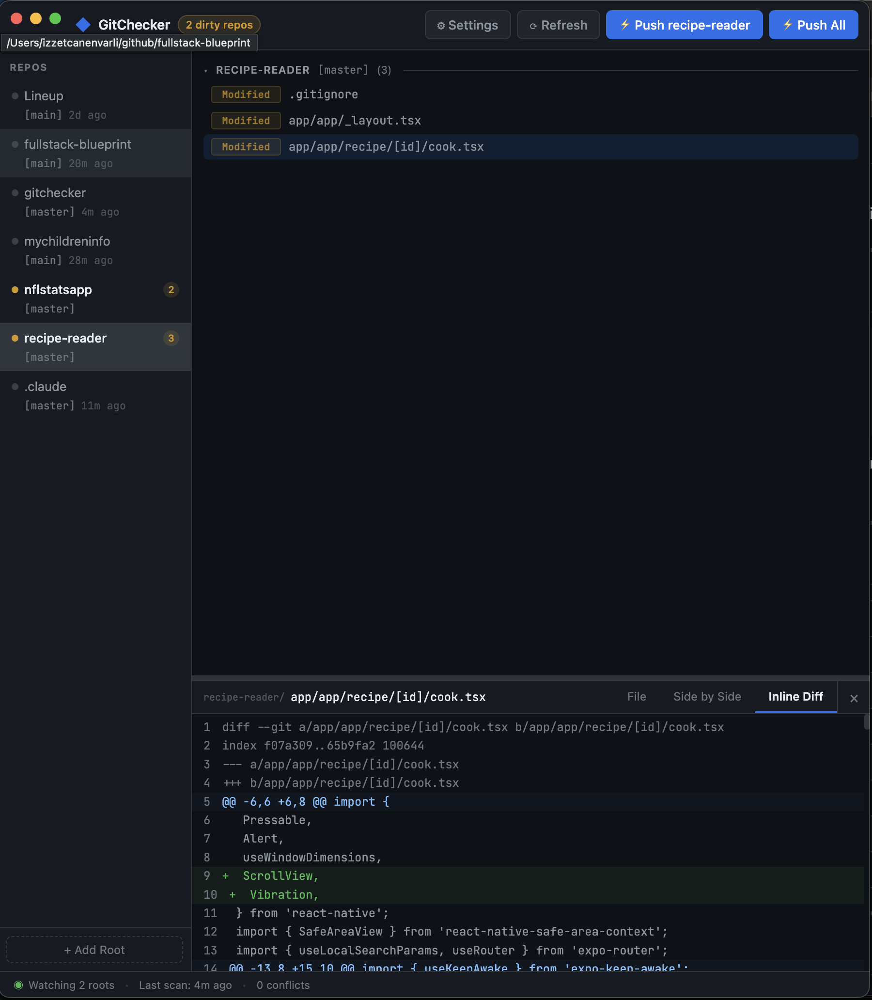

# GitChecker

A macOS desktop app that watches all your git repos at once and lets you push everything with AI-generated commit messages.

  

---

## What it does

If you work across many repos at the same time, GitChecker shows you everything that's dirty in one place. Instead of `cd`-ing into each repo and running `git status`, you see all your changes at a glance — and you can commit and push them all in one click with commit messages generated by Claude.

**Core features:**

- **Live repo monitor** — watches `~/github` (configurable) and shows all dirty files across every repo in real time
- **Inline file viewer** — click any file to see its full content, a side-by-side diff, or an inline diff without leaving the app
- **AI commit messages** — uses the [Claude CLI](https://docs.anthropic.com/en/docs/claude-code) to generate conventional commit messages from your actual diffs
- **Push All** — pulls, commits, and pushes every dirty repo in parallel; auto-resolves merge conflicts via Claude
- **Push single repo** — select a repo in the sidebar to get a dedicated push button for just that repo
- **Secret scanning** — detects API keys, tokens, and `.env` files before pushing and warns you
- **`.gitignore` management** — right-click any file to ignore it, its extension, or its directory; automatically untracks already-tracked files
- **Per-file staging** — stage or unstage individual files from the right-click menu

---

## Screenshot



---

## Requirements

- macOS (tested on macOS 14+)
- Node.js 20+
- Git
- [Claude CLI](https://docs.anthropic.com/en/docs/claude-code) — optional, but required for AI commit messages and conflict resolution

---

## Quick install (with Claude Code)

If you have [Claude Code](https://docs.anthropic.com/en/docs/claude-code) installed, this is the fastest way to go from clone to running app:

```bash
git clone https://github.com/canenvarli/gitchecker.git
cd gitchecker
npm install
claude
```

Then inside Claude Code, run:

```
/installmac
```

That's it — it builds the DMG, mounts it, copies `GitChecker.app` to `/Applications`, and cleans up. Launch from Spotlight or the Applications folder.

---

## Manual install

```bash
git clone https://github.com/canenvarli/gitchecker.git
cd gitchecker
npm install
npm run build:dmg
```

Then open `release/GitChecker-*-arm64.dmg` and drag the app to `/Applications`, or run the install script directly:

```bash
./scripts/install-mac.sh
```

---

## Development

```bash
npm install
./dev.sh
```

`./debug.sh` does the same thing but opens the DevTools panel automatically and writes all output to `logs/app.log`.

---

## Scripts

| Command | What it does |
|---|---|
| `./dev.sh` | Start the app in dev mode with hot reload |
| `./debug.sh` | Dev mode + DevTools open + logs to `logs/app.log` |
| `npm run build` | Compile TypeScript and bundle the app |
| `npm run build:dmg` | Build a distributable macOS DMG (universal x64 + arm64) |
| `npm run typecheck` | Type-check without emitting |
| `npm run lint` | ESLint |
| `npm run test` | Run the full test suite (Jest + Playwright) |

---

## How the push flow works

1. Click **Push All** (or **Push [repo name]** for a single repo)
2. GitChecker calls the Claude CLI with each repo's diff to generate a conventional commit message
3. You can edit the messages before confirming
4. Secret scanner runs — if anything suspicious is found you get a warning with a preview
5. For each repo in parallel: `git pull` → `git add -A` → `git commit` → `git push`
6. If a pull causes a merge conflict, Claude reads the conflict markers and resolves them automatically
7. Progress is streamed live in the modal; any errors surface as toast notifications

If the Claude CLI is not installed, commit messages fall back to `chore: update files` and conflicts fall back to the HEAD side.

---

## Project structure

```
src/
├── main/               # Electron main process (Node.js)
│   ├── index.ts        # App entry, window setup
│   ├── ipc/            # IPC request handlers
│   ├── git/            # Status scanning, file watching, git operations
│   ├── claude/         # Claude CLI integration (commit messages, conflict resolution)
│   ├── secrets/        # Secret pattern scanning
│   └── config/         # Persistent config via electron-store
│
├── preload/
│   └── index.ts        # Security bridge — IPC whitelist, context isolation
│
└── renderer/           # React frontend
    ├── App.tsx          # Root component and layout
    ├── components/      # TitleBar, RepoList, FileList, FileViewer, PushModal, ...
    ├── hooks/           # useRepos, usePush, useConfig, useToast
    └── types/           # Shared TypeScript interfaces
```

---

## Security model

The renderer process (React UI) runs with `nodeIntegration: false` and `contextIsolation: true`. It can only call a fixed set of IPC channels that are explicitly whitelisted in `src/preload/index.ts` — nothing else is reachable from the frontend. All file path operations in the main process are validated to prevent path traversal.

---

## Configuration

On first launch, GitChecker watches `~/github` for git repos. You can change this in **Settings**:

- **Watch roots** — directories to scan for repos (scans recursively, up to 3 levels deep)
- **Ignored repos** — specific repo paths to exclude from the list
- **Ignore patterns** — glob patterns to skip files from the dirty list (e.g. `*.lock`, `package-lock.json`)

Config is stored in the standard Electron user data directory (`~/Library/Application Support/GitChecker/`).

---

## Tech stack

- [Electron 28](https://electronjs.org/) — desktop shell
- [React 18](https://react.dev/) + TypeScript — UI
- [Vite](https://vitejs.dev/) + [vite-plugin-electron](https://github.com/electron-vite/vite-plugin-electron) — build tooling
- [simple-git](https://github.com/steveukx/git-js) — git operations
- [chokidar](https://github.com/paulmillr/chokidar) — file watching (watches `.git/index` and `.git/HEAD`, not the full tree)
- [electron-store](https://github.com/sindresorhus/electron-store) — persistent config
- [Claude CLI](https://docs.anthropic.com/en/docs/claude-code) — AI commit messages and merge conflict resolution

---

## License

[MIT](LICENSE) © 2026 Izzet Can Envarli
